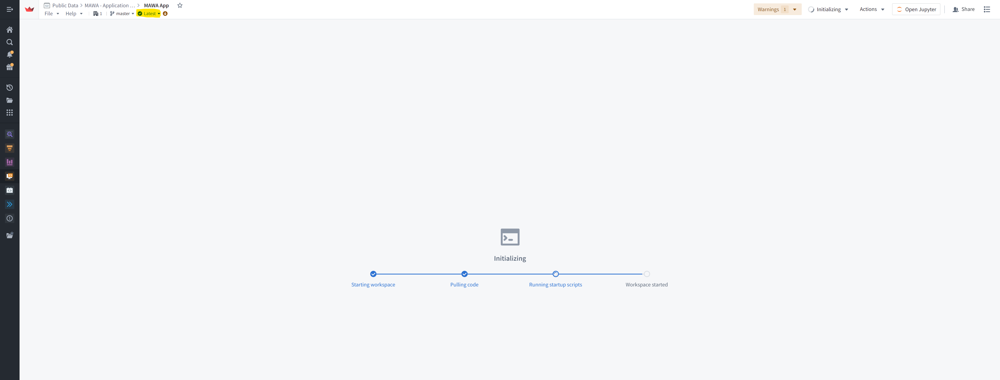
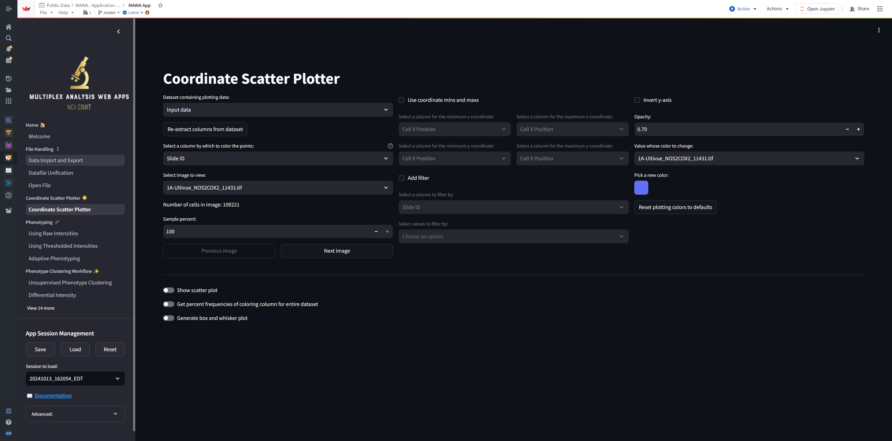
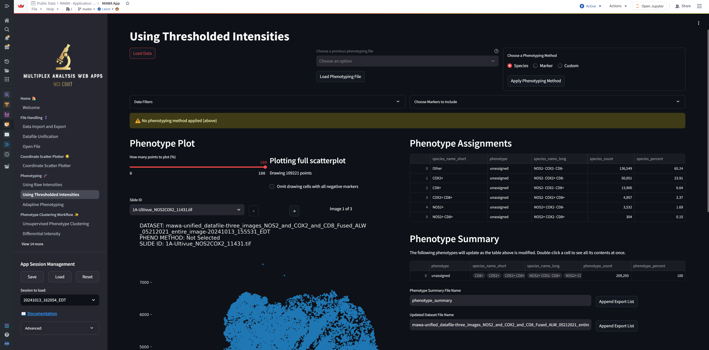
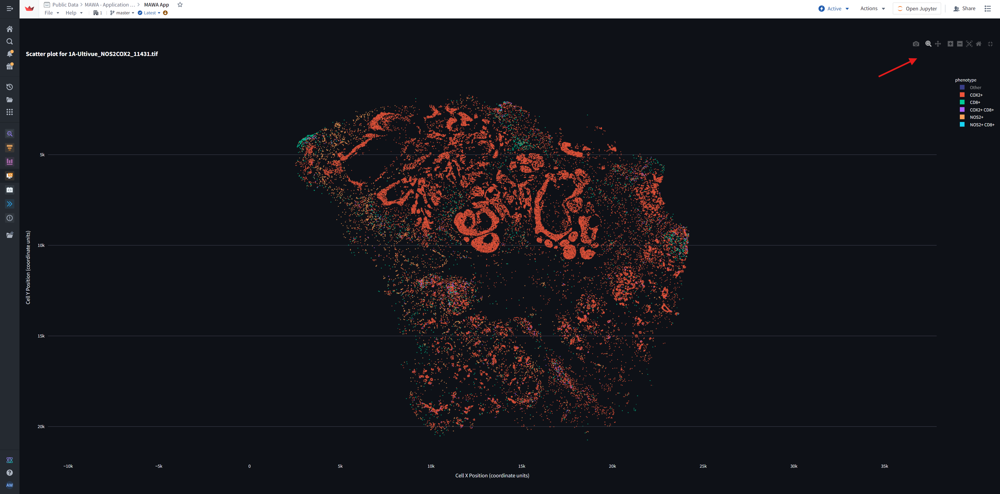

# Session 1: Introduction to NIDAP. MAWA fundamentals. Supervised phenotyping

## Session information

* **Date**: Tue 10/15/24, 1-2 PM
* **Speaker**: Andrew Weisman, Ph.D.
* **[Link](https://bioinformatics.ccr.cancer.gov/btep/classes/spatial-omics-data-analysis-introduction-to-nidap-and-mawa-fundamentals)**

## Introduction

MAWA (Multiplex Analysis Web Apps) is new, open-source software capable of performing file handling, phenotyping, and spatial analysis on segmented spatial transcriptomics/proteomics data. Implementing multiple published and novel methodologies, it is extremely performant and user-friendly, aiming to be accessible to users of all skill levels.

MAWA can be run either locally, requiring [installation](https://github.com/ncats/multiplex-analysis-web-apps/tree/develop), or on the cloud. Cloud options include the [NIH Integrated Data Analysis Platform (NIDAP)](https://nidap.nih.gov), which provides a secure, powerful environment for NIH researchers, and [Streamlit Community Cloud](https://nci-mawa.streamlit.app), which is open to the general public on a shared computing environment. Deployment on NIDAP will be the focus of this workshop. Deployment on Streamlit Community Cloud is brand new and requires a few more tweaks. All three deployment options share the same [codebase](https://github.com/ncats/multiplex-analysis-web-apps/tree/develop), so MAWA's features are consistent across all platforms.

## NIH Integrated Data Analysis Platform (NIDAP)

NIDAP's filesystem is organized into Projects, which usually corresponds to research groups. Each Project can contain both user data and instances of NIDAP applications. MAWA is an instance of the Code Workspaces application.

You can [explore MAWA in a public project](https://nidap.nih.gov/workspace/compass/view/ri.compass.main.folder.a50782c9-f612-4476-9633-49eb266dbaed), which will be used during this workshop. To create a secure deployment for your group, [contact us](mailto:andrew.weisman@nih.gov) to have MAWA set up in your project. Once set up, you will be given a URL to access your instance of MAWA, bringing you to a page that looks like this:

(Note it is recommended to use the Chrome web browser for NIDAP.)

Here you will generally see four items:

* `input` is a folder where you place your datafiles, which can be `.csv`, `.tsv`, or `.txt`.
* `output` is a folder where MAWA will save its results.
* `MAWA App` is what you click on to start the app.
* `MAWA developer workspace` is reserved for admins and developers.

When you click into the `input` folder (generally, it helps to do this in a new tab by `Ctrl`-clicking it), you will see something like this:

To upload your data into NIDAP, click on the Import button in the top right or drag and drop your datafile(s) into the window, resulting in a pop-up like this:

Make sure that "Add file(s)" is selected before you press the blue Next button to import your data into NIDAP.

Note that zipping of files is supported. E.g., you can optionally zip `myfile.csv` into `myfile.csv.zip` before uploading an individual file. Also note that datafiles are never modified by MAWA unless you explicitly overwrite a file, which is rare.

Other than the `input` folder, the only other item in the MAWA workspace that you will generally interact with is the `MAWA App`:

After clicking on it (again, it generally helps to do this in a new tab by `Ctrl`-clicking it), the app will open in 2-6 minutes.

As the app opens, if you see a glowing Warnings message in the top right, as below, do not worry about it (unless the adjacent number is greater than 1). In addition, if you do not see Latest as highlighted in the top left, you will see a prominent banner to restart the app to pick up the latest changes; if so, click on the restart link in the banner to do so:

## File handling

### Overview

Once the app is open, you will see a page like this:

Note the above screenshot has the NIDAP sidepanel on the left collapsed, which is done by clicking on the three horizontal lines in the top left. This is generally recommended to maximize the app's screen real estate.

If you click on "View 14 more" in the left sidebar, you will see a list of all the functionalities available in MAWA:

Clicking on each "page" will bring up a new page with a different set of functionalities. Today we will cover what is in green ("Week 1"), and we will cover the other pages in subsequent sessions.

Below the page listing are a few more items:

You will see three buttons and a dropdown menu in the App Session Management section. It is a good practice to occassionally press the Save button to save your work, particularly after performing a time-consuming operation. This will save the entire state of the app. When there are sessions that have been saved, they will be available in the dropdown menu "Session to load:". To load a session, select it from the dropdown and press the Load button. To reset the state of the entire app, press the Reset button.

Next, you will see a link for the MAWA documentation. Please keep in mind that the documentation is a work in progress.

Finally, you will see an "Advanced:" dropdown menu, reserved for developers and admins.

In the main part of the app, you will see the contents of the first page in the sidebar, which is the Welcome or Home page. Like the documentation, this page is a work in progress and is meant to provide a brief overview of the app.

### Data Import and Export

Now we want to load the data that we previously uploaded into the `input` folder. To do this, click on the "Data Import and Export" page in the sidebar:

You will see all available datafiles from the `input` folder listed in the "📂 Available input data on NIDAP" table in the top left. To load datafiles for analysis from NIDAP to MAWA, select the datafiles you want to load by clicking on the checkboxes in the Selected column and "Load selected NIDAP input data" button.

While the data are being transferred (typically takes a few seconds), you will see the app partially grayed out and "RUNNING..." message in the top right. This is typical behavior while an operation is running in the app. Generally, you should not interrupt the process by pressing the Stop button in the top right:

After the data have been transferred, you will see the datafiles listed in the "📂 Input data in MAWA" table in the top right:

We will return to this Data Import and Export page multiple times during this workshop.

### Datafile Unification

Next, we want to combine multiple datafiles into a single dataset, after which we want to perform some basic preprocessing to ensure the resulting dataset is compatible with the rest of the functionalities in MAWA. To do this, click on the "Datafile Unification" page in the sidebar:

Steps to perform on this page, in sequence, will be identified by bright blue numbers. In section "1️⃣ Select datafile(s)", we will select the datafiles we want to combine by clicking on the checkboxes in the Selected column and then pressing the "Combine selected files into single dataframe" button:

Note that if the selected datafiles do not have exactly the same columns, only the common set of columns will be used in the combined dataset. The excluded columns will be listed; if you don't see such a listing, then you know all selected datafiles have the same columns.

Upon pressing the button, you will see the rest of the sections on the page populate,

including a sample of the unified dataset at the bottom:

This preview (and the number of rows/columns above it) has two main purposes: (1) to serve as a sanity check that everything looks reasonable, and (2) to display the column names that will be needed for further processing on this Datafile Unification page. Note that this (and any) table of data are interactive and can be maximized by hovering over it and clicking on the maximize button in the top right:

In section "2️⃣ Delete null rows", press the "Detect null rows in each column" button to display the number of null rows in each column containing null values. If null data are detected in columns that you expect would be used in downstream analyses, you should delete the null values by expanding the "Click to expand:" dropdown and selecting one or more column names containing null values. (If you suspect all relevant columns contain the same null rows, you only need to select one of these columns.) Then press the "Delete rows from dataframe" button to delete the rows having null values in the selected columns. If rows were deleted, a message will display saying how many were deleted. You can confirm that the rows have been deleted by clicking again on the "Detect null rows in each column" button.

If no null rows are detected, you will see something like this:

Use the sample of the unified dataset at the bottom to identify a column(s) whose values uniquely identify the slides/images in the dataset. In section "3️⃣ Identify images", select the column name(s) from the dropdown menu and press the "Assign images" button. This will add a new column to the dataset containing the unique image IDs, as can be confirmed in the sample of the unified dataset at the bottom:

If your dataset contains a column that specifies regions of interest (ROIs) within the images, step "4️⃣ Identify regions of interest (ROIs)" allows you to select that column name by turning on the "Identify dataframe column that identifies ROIs" toggle. Most groups do not have such a column. In either case, the "Assign ROIs" button must be pressed:

Section "5️⃣ Identify coordinates" allows you to select the columns that contain the x and y coordinates of the cells/objects. If the dataset has already calculated the their locations using a single coordinate, then the "One column (centroid)" radio button should be selected. On the other hand, if the centroid has not already been calculated, and instead only the coordinates of the x and y bounding boxes for the cells are specified, then "Two columns (min and max)" should be selected. Regardless, the corresponding column names (which again can be determined from the dataset sample at the bottom) should be selected from the dropdown menus.

In addition, this is the place to specify the units of the coordinates in the dataset. In particular, a value should be entered identifying the number of microns per coordinate unit. E.g., if dataset units are in pixels, then the number of microns per pixel should be entered. If the coordinate units are already in microns, then this value should remain the default of 1.0.

After the coordinate columns and unit conversions have been specified, press the "Assign coordinates" button. This will add new columns to the dataset containing the x and y coordinates of the cells/objects, as can be confirmed in the sample of the unified dataset at the bottom:

Section "6️⃣ Identify phenotypes (optional)" allows you to identify phenotypes that may have already been defined in the dataset. This would manifest in one of two ways: (1) a single column containing the phenotype names, or (2) multiple already-thresholded columns indicating positivity (i.e., "+" or "-" or "1" or "0") of the markers corresponding to these columns. E.g., in case #2, we might have one column specifying CD8 positivity via a 0 or a 1 in each row and a second column specifying CD3 positivity via a 0 or a 1 in each row. In this latter case, you would expand the dropdown, select "One binary column per phenotype", and select the CD8 and CD3 columns.

In case #1, we would instead select "One column for all phenotypes" and select the column containing the phenotype names. In either case, the "Select phenotypes" button should be pressed.

In our example, we have case #2:

Section 6 then gives you the option to rename the detected phenotypes, which you do by double-clicking in the "New phenotype name" column of the phenotype you wish to rename and entering a new name. Note that currently, it is best to rename any phenotypes with "+" or "-" in their names, as these characters can produce unsightly phenotype names in some downstream analysis (this will be fixed in a future release):

When you're done optionally renaming the phenotypes, press the "Assign phenotypes" button:

Note that often the "raw" (instead of already-"thresholded") intensities will be used for phenotyping and downstream analysis, so there is often no need to complete step 6.

Finally, in section "7️⃣ Save the dataframe to the `input` directory (optional)", you can save the unified dataset to the input files available to MAWA by entering a descriptive basename in the text box and pressing the "Save dataframe to CSV" button:

Note that "input" in "7️⃣ Save the dataframe to the `input` directory (optional)" refers to the "input" directory in the MAWA app, as opposed to the `input` folder on NIDAP. We still must save the unified dataset to the `input` folder on NIDAP, as we do next.

If you then return to the Data Import and Export page, you will see the new datafile listed in the "📂 Input data in MAWA" table:

To save this unified dataset for future use, allowing you to skip the entire process on the Datafile Unification page for this dataset, you select the basename of the file in the "🚜 Save MAWA-unified datafile to NIDAP" section in the top middle and press the "Save selected (above) MAWA-unified datafile to NIDAP" button:

You can confirm that the file has been saved to NIDAP by pressing the "Refresh available input data" button in the top left and noting the file now present at the bottom of the "📂 Available input data on NIDAP" table:

If you refresh the `input` folder on NIDAP, you should now see the unified datafile:

The next time MAWA is loaded, you can load this unified dataset instead of the individual datafiles, saving you time and effort.

Since we just expended a bit of effort, this would be a good time to hit the Save button in the App Session Management section in the left sidebar to save your work:

### Open File

After having run the Datafile Unification page, if we load the Open File page, the toggle "Load dataset from Datafile Unifier" will be on by default:

This will allow you to load the unified dataset that you just generated from system memory.

In general, since the Datafile Unification steps will only be run once per dataset, in future MAWA sessions the unified dataset should be loaded directly from the unified datafile and the toggle will be off. To show what this normal process would look like, turn off the toggle, selected the unified datafile, and press the "Load the selected input dataset" button:

As on the Datafile Unification page, you will see an interactive sample of the dataset at the bottom, above which various properties of the dataset will be displayed. Note that the "Coordinate units:" value is listed as `1.0 microns/coord` because we already converted the dataset to microns on the Datafile Unification page.

The dataset loaded on the Open File page will be that used for the rest of the functionalities in MAWA. Pressing the "Load the selected input dataset" button will generally re-open the dataset and reset downstream analyses.

### Coordinate Scatter Plotter

The Coordinate Scatter Plotter page allows you to visualize the x and y coordinates of the cells/objects in the dataset. To do this, click on the "Coordinate Scatter Plotter" page in the sidebar:

For our sample dataset, we know the y axis should be flipped, so check the "Invert y-axis" in the top right. Display the scatter plot by turning on the "Show scatter plot" toggle:

It is apparent from the scatter plot, which is fully interactive, that the circular markers obscure the underlying data at this zoom level. A robust way of addressing this common problem is to plot the bounding box for each cell instead of a marker denoting its centroid. To do this, turn off the "Show scatter plot" toggle (so the plot is not constantly redrawn while we make changes), check the "Use coordinate mins and maxs" checkbox, select the column names for the x and y mins and maxs from the dropdown menus, and turn on the "Show scatter plot" toggle again:

This better depicts the underlying cellular structure within the slide.

To color the cells by COX2 positivity, select "Phenotype COX2" in the "Select a column by which to color the points:" dropdown:

Keep in mind that it only makes sense to color the cells by the values in a single column. Soon, we will assign a single phenotype label to each cell--i.e., "phenotype" the cells via a single "phenotype" column--and we will be able to visualize the phenotyping results by coloring the cells by this column.

## Supervised phenotyping

### Using Thresholded Intensities

To use multiple positivity columns of already-"thresholded" intensities--rather than "raw" intensities--to phenotype the cells, we will click on the "Using Thresholded Intensities" page of the Phenotyping section of the sidebar:

Press the Load Data button to load the dataset into the thresholded phenotyper:

In the Phenotype Assignments table, you will see the unique combinations of the markers you previously selected on the Datafile Unification page, ordered by decreasing frequency in the three-image dataset, e.g., NOS2- COX2- CD8- (i.e., all negative, i.e., "Other"), NOS2- COX2+ CD8- (i.e., COX2+), NOS2- COX2- CD8+ (i.e., CD8+), NOS2- COX2+ CD8+ (i.e., COX2+ CD8+), etc. Each unique combination of markers such as these is called a "species" in MAWA.

The "species" phenotyping method simply assigns the cell "species" to the phenotype of the cell. I.e., the label for NOS2- COX2+ CD8- cells is "COX2+", the label for NOS2+ COX2- CD8+ cells is "NOS2+ CD8+", etc.

Let's apply the "species" phenotyping method to the dataset by selecting Species in "Choose a Phenotyping Method" and pressing the "Apply Phenotyping Method" button:

Note the phenotype names in the "phenotype" column of the table in the Phenotype Summary section, which is consistent with the "species" phenotyping method described above. To visualize the phenotyping results, click on the "Coordinate Scatter Plotter" page in the sidebar, select "Phenotyped data" in the "Dataset containing plotting data:" dropdown, select "phenotype" in the "Select a column by which to color the points:" dropdown, and turn on the "Show scatter plot" toggle:

Note that by hovering over the image and clicking on the resulting maximize button, we can view a full screen view of the image. Further, if we click once on the "Other" label in the legend, we can hide the all-negative cells, which can be useful for focusing on the positive cells:

When hovering over the scatter plot, there are more options available in the top right, including the ability to zoom in and out, pan, and save the plot to your computer as an image.

Returning to the Thresholded Intensities page, say that we...
