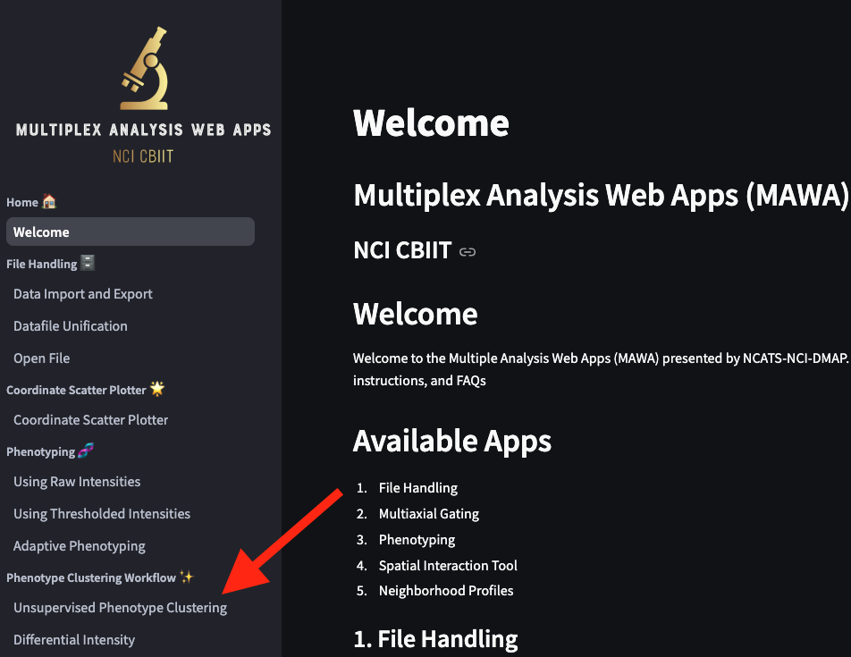
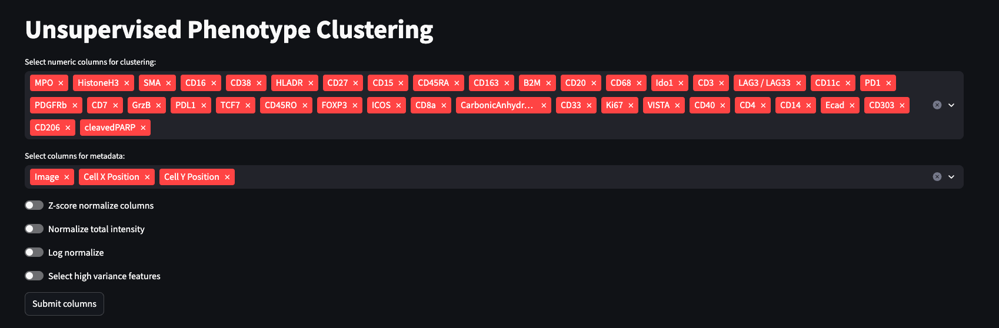
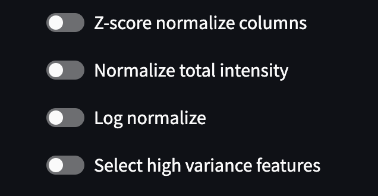
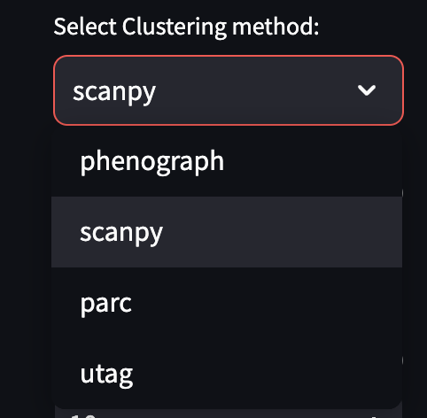
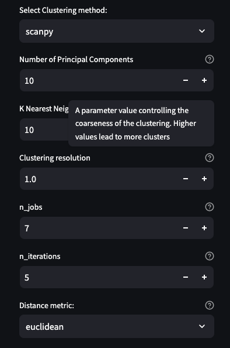
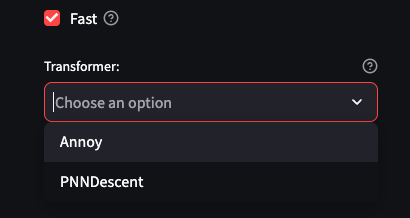
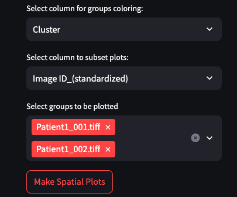
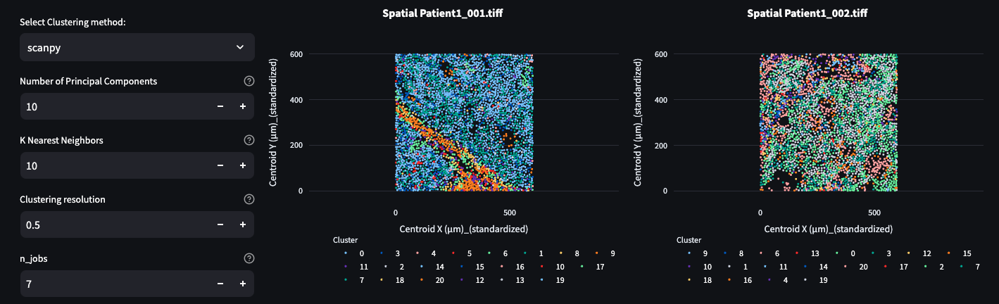

**Introduction**

Unsupervised clustering provides several advantages over traditional manual annotation of the cell types. All images in the dataset can be evaluated together and it helps to reduce personally introduced bias. Unsupervised clustering workflow primarily consists of two steps, construction of the neighborhood graph and evaluation of the graph with a community detection algorithm. 

To select Unsupervised Phenotype Clustering application click on it in the left side menu.

**Data preprocessing**

You will be presented with multiselect column options

For the top multiselect option, you'll need to choose numeric columns, based on which you would like your data to be clustered.
The following multiselect input field accepts columns that will be added as metadata (Currently standardized columns for Image ID and coordinates of the cells have to be included in the selection).

The next set of toggles includes normalization and scaling options

[Z-score normalization](https://scanpy.readthedocs.io/en/stable/generated/scanpy.pp.scale.html) is a method of scaling data so that it has a mean of 0 and a standard deviation of 1.

[Normalize total intensity](https://scanpy.readthedocs.io/en/stable/generated/scanpy.pp.normalize_total.html) adjusts each cell by total intensity/counts over all markers, so that every cell has the same total intensity/count after normalization.

[Log normalize](https://scanpy.readthedocs.io/en/stable/generated/scanpy.pp.log1p.html) applies natural logarithm normalization.

Lastly, [Select high variance features](https://scanpy.readthedocs.io/en/stable/generated/scanpy.pp.highly_variable_genes.html) is currently an experimental method that might help to select most variable markers.

After selecting columns and normalization methods, you may click **Submit columns** button, to create a dataset that will be used for clustering.

**Clustering options**

In MAWA, we included four peer reviewed methods for unsupervised clustering, including Phenograph, Scanpy clustering workflow, PARC, and UTAG.

[Phenograph](https://github.com/dpeerlab/phenograph?tab=readme-ov-file) constructs a knn graph with a kdtree algorithm and adds weights to the edges and applies pruning of the graph based on the Jaccard similarity index, with subsequent application of Louvain or Leiden community detection methods and is known for its ability to identify clusters even for rare cell types.

[Scanpy](https://github.com/scverse/scanpy) workflow is very well established in signle cell RNA community and uses NearestNeighbours class from sci-kit learn and UAMP for construction and addition of weights to the nearest neighbor graph. 

[PARC](https://github.com/ShobiStassen/PARC) performs k-nearest neighbor search with hierarchical navigable small world algorithm and further goes through local and global pruning of weak graph edges with the subsequent usage of a Leiden community detection method. PARC was tested with single cell transcriptomics and imaging data types.

[UTAG](https://github.com/ElementoLab/utag) applies the same methodology as Scanpy for knn graph building but also accounts for spatial relationships between cells in a physical space.

Each of the clustering methods includes its' own set of the parameters that can be tuned for optimal clustering results. Placing the cursor on the `?` sign that is located near each parameter provides a brief description of it.

In addition, each of the clustering methods includes an option to increase the computational speed, via application of approximate nearest neighbor search (instead of exact one) and iGraph's implementation of [Leiden algorithm](https://python.igraph.org/en/stable/api/igraph.Graph.html#community_leiden).

After all clustering options are selected, we can run the analysis by clicking on the `Run Clustering` button.

**Clustering Visualization**

After clustering is completed, we can produce spatial plots that would place cells on the Y and X axes based on their coordinates and color them by cluster identity.

To produce the plots, select to color groups by `Cluster`, subset plots by `Image ID`, select images that you'd like to be plotted, and click `Make Spatial Plots` button.

Spatial plots will appear in the top right corner of the page and would look similar to the example below.

