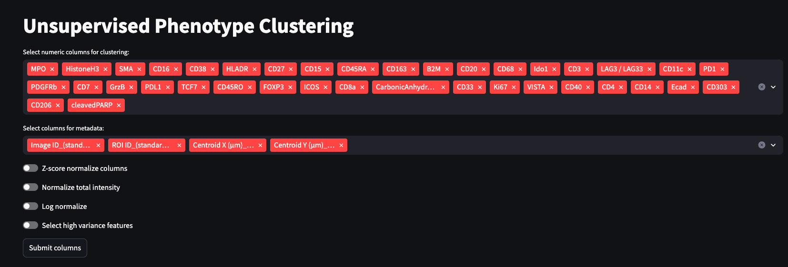

**Introduction**

Unsupervised clustering provides several advantages over traditional manual annotation of the cell types. All images in the dataset can be evaluated together and it helps to reduce personally introduced bias. Unsupervised clustering workflow primarily consists of two steps, construction of the neighborhood graph and evaluation of the graph with a community detection algorithm. 

To select Unsupervised Phenotype Clustering application click on it in the left side menu.

**Data preprocessing**

You will be presented with multiselect column options

For the top multiselect option, you'll need to choose numeric columns, based on which you would like your data to be clustered.
The following multiselect input field accepts columns that will be added as metadata (Currently standardized columns for Image ID and coordinates of the cells have to be included in the selection).

The next set of togles includes normalization and scaling options

[Z-score normalization](https://scanpy.readthedocs.io/en/stable/generated/scanpy.pp.scale.html) is a method of scaling data so that it has a mean of 0 and a standard deviation of 1.

[Normalise total intensity](https://scanpy.readthedocs.io/en/stable/generated/scanpy.pp.normalize_total.html) adjusts each cell by total intensity/counts over all markers, so that every cell has the same total intensity/count after normalization.

[Log normalize](https://scanpy.readthedocs.io/en/stable/generated/scanpy.pp.log1p.html) applies natural logarithm normalization.

Lastly, [Select high variance features](https://scanpy.readthedocs.io/en/stable/generated/scanpy.pp.highly_variable_genes.html) is currently an experimental method that might help to select most variable markers.

**Clustering options**

