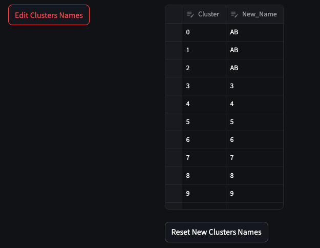

# Spatial Omics Data Analysis with MAWA

## Session 2: Unsupervised clustering

## Session information

- **Date**: Tue 10/22/24, 1-2 PM
- **Speaker**: Andrei Bombin, Ph.D.
- **[Session information](https://bioinformatics.ccr.cancer.gov/btep/classes/spatial-omics-data-analysis-unsupervised-phenotyping-with-mawa)**
- **[Main training page](https://github.com/ncats/mawa-training-materials/tree/develop)**
- **[Video of session material](https://nih-my.sharepoint.com/personal/bombina2_nih_gov/Lists/Unsupervised_clustering/AllItems.aspx?login_hint=bombina2%40nih%2Egov&web=1&referrer=OfficeHome%2EWeb&referrerScenario=StreamStartPage&isDarkMode=false&viewid=1436096b%2D09bb%2D4b14%2Db378%2Da49601de4fcd&playlistLayout=playback&itemId=1)**
- **[Session slides](https://github.com/ncats/mawa-training-materials/blob/develop/session_2/Unsupervised_Clustering_Training_Slides.pdf)**
- **[Recording of session](https://cbiit.webex.com/recordingservice/sites/cbiit/recording/115c5e87cd704749b3773470ff227a09/playback)**
- All data generously provided by the David Wink lab

**Introduction**

Unsupervised clustering provides several advantages over traditional manual annotation of the multiplex imaging datasets. Cells from all images can be evaluated together, which reduces the amount of time that is required for annotation. In addition, original cell identities are determined by applying computational methods to quantitative phenotypic data, which reduces personal bias associated with manual annotations. Unsupervised clustering workflow primarily consists of two steps, construction of a neighborhood graph and evaluation of the graph with a community detection algorithm. 

To select Unsupervised Phenotype Clustering application click on it in the left side menu.

**Data preprocessing**

You will be presented with multiselect column options

For the top multiselect option, you'll need to choose numeric columns, based on which you would like your data to be clustered.
The following multiselect input field accepts columns that will be added as metadata (Currently standardized columns for Image ID and coordinates of the cells have to be included in the selection).

The next set of toggles includes normalization and scaling options

[Z-score normalization](https://scanpy.readthedocs.io/en/stable/generated/scanpy.pp.scale.html) is a method of scaling data so that it has a mean of 0 and a standard deviation of 1.

[Normalize total intensity](https://scanpy.readthedocs.io/en/stable/generated/scanpy.pp.normalize_total.html) adjusts each cell by total intensity/counts over all markers, so that every cell has the same total intensity/count after normalization.

[Log normalize](https://scanpy.readthedocs.io/en/stable/generated/scanpy.pp.log1p.html) applies natural logarithm normalization.

Lastly, [Select high variance features](https://scanpy.readthedocs.io/en/stable/generated/scanpy.pp.highly_variable_genes.html) is currently an experimental method that might help to select most variable markers.

After selecting columns and normalization methods, you may click **Submit columns** button, to create a dataset that will be used for clustering.

**Clustering options**

In MAWA, we included four peer reviewed methods for unsupervised clustering, including Phenograph, Scanpy clustering workflow, PARC, and UTAG.

[Phenograph](https://github.com/dpeerlab/phenograph?tab=readme-ov-file) constructs a knn graph with a kdtree algorithm and adds weights to the edges and applies pruning of the graph based on the Jaccard similarity index, with subsequent application of Louvain or Leiden community detection methods and is known for its ability to identify clusters even for rare cell types.

[Scanpy](https://github.com/scverse/scanpy) workflow is very well established in signle cell RNA community and uses NearestNeighbours class from sci-kit learn and UAMP for construction and addition of weights to the nearest neighbor graph. 

[PARC](https://github.com/ShobiStassen/PARC) performs k-nearest neighbor search with hierarchical navigable small world algorithm and further goes through local and global pruning of weak graph edges with the subsequent usage of a Leiden community detection method. PARC was tested with single cell transcriptomics and imaging data types.

[UTAG](https://github.com/ElementoLab/utag) applies the same methodology as Scanpy for knn graph building but also accounts for spatial relationships between cells in a physical space.

Each of the clustering methods includes its' own set of the parameters that can be tuned for optimal clustering results. Placing the cursor on the `?` sign that is located near each parameter provides a brief description of it.

In addition, each of the clustering methods includes an option to increase the computational speed, via application of approximate nearest neighbor search (instead of exact one) and iGraph's implementation of [Leiden algorithm](https://python.igraph.org/en/stable/api/igraph.Graph.html#community_leiden).

After all clustering options are selected, we can run the analysis by clicking on the `Run Clustering` button.

**Clustering Visualization**

After clustering is completed, we can produce spatial plots that would place cells on the Y and X axes based on their coordinates and color them by cluster identity.

To produce the plots, select to color groups by `Cluster`, subset plots by `Image ID`, select images that you'd like to be plotted, and click `Make Spatial Plots` button.

Spatial plots will appear in the top right corner of the page and would look similar to the example below.

Another way to visualize clustering results is to use Uniform Manifold Approximation and Projection for Dimension Reduction ([UMAP](https://umap-learn.readthedocs.io/en/latest/)) method. UMAP allows to represent multidimensional data in two dimensions and aims to preserve global structure of the data and maintain local relationships.

To visualize your data with UMAP, click `Compute UMAP` button and wait for the calculations to be completed.

You can specify the same options for UMAP visualization and produce UMAPs for each image by clicking `Plot UMAPs` button.

The UMAPs will appear in the top right corner of the page

In addition, UMAP allows to visualize clustering results for all images/samples, at once.
In order to do so, replace specific images selection in `Select groups to be plotted` with `All` option and click `Plot UMAPs` button again.

The output will appear in the top right corner of the page.

Generally, cells belonging to the same cluster will be more similar to each other than to cells from other clusters.

After the initial clustering, you can select to add Cluster identity of each cell to the original input table by clicking `Add Clusters to Input Data` or proceed with the differential intensity/expression analysis.

**Differential Intensity/Expression**

To proceed with differential intensities/expression, select `Differential Intensity` application in the left side menu.

Our current implementation of differential intensity/expression method, performs Wilcoxon Rank Sum test on a selected group of cells, comparing it to the rest of the cells, in the data.

The first option allows you to select any metadata column, based on which you would like to perform differential analysis. In the provided example `Cluster` column that contains clusters' IDs of the cells from the previous analysis is selected.

The next multiselect field allows you to select groups for which differential analysis will be performed. In the example above, we selected to identify markers for clusters 0 and 13.

Selecting `Only Positive Markers` option, will return markers that have intensity/expression significantly higher for a elected group of cells. Otherwise, all markers which intensity/expression is significantly different between a selected cells group and the rest of the cells are returned.

Clicking `Run Differential Intensity` button will run the analysis and return the following table.

Columns of the table include group ID for which differential analysis was performed, names of identified markers, scores for the Wilcoxon test, log2 fold change between intensity/expression of the marker withing a selected group and the rest of the cells, p-values calculated for the test, and p-values adjusted for multiple testing with a Benjamini-Hochberg (FDR) method.

**Differential Intensity Visualization**

We provide several options for visualization of differential intensities results that include rank plot, heatmap, and UMAP in which cells are colored based on intensity/expression of the markers. 
To produce a plot, just select a type of figure that you woudld like to produce, the number of markers to be plotted, and click `Plot Markers` button.

**Rank plot** shows top markers for each cluster based on Wilcoxon Rank Sum Test scores.

**Heat map** helps to visualize mean intensity/expression of the markers in clusters selected for analysis.

**UMAP** shows intensity/expression of the markers for each cell on the UMAP.

Currently, data are normalized and scaled by default, for heat maps and UMAPs intensity plots. These steps would be added as additional options, soon.

**Editing Clusters IDs**

In addition, it is possible to edit cluster identities, which can be useful in order to group similar cell types that might be identified during previous analysis steps.

In order to do so, you can add a new cluster name near the original cluster identity and click `Edit Clusters Names`.

This action will create a new metadata column `Edit_Cluster` for current analysis.
In the example above, clusters 0, 1, and 2 will be renamed as AB.
`Reset New Cluster Names` button will restore the original clusters IDs.

New cluster names can be used to produce spatial plots and UMAPs with edited IDs.

Or can be used as a new group for differential intensity/expression analysis.

Renamed clusters can be added to the original dataset by clicking `Add Edited Clusters to Input Data` button located in the bottom of the page.

Thank you for your attention.

Please send your questions/recommendations in regard to **Unsupervised Clustering** workflow to
Andrei Bombin:

bombina2@nih.gov or
abombin93@gmail.com
