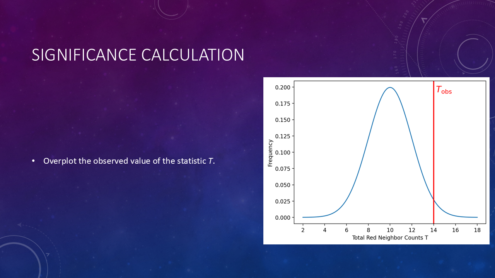
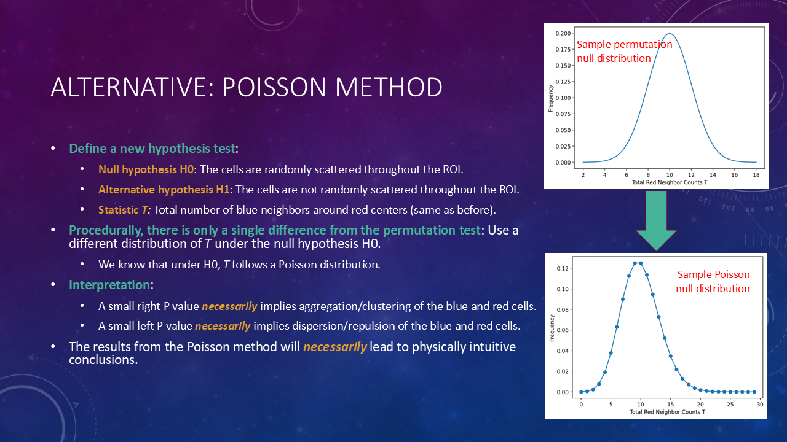

# Spatial Omics Data Analysis with MAWA

## Session 3: Pairwise spatial analysis using hypothesis testing

- [Spatial Omics Data Analysis with MAWA](#spatial-omics-data-analysis-with-mawa)
  - [Session 3: Pairwise spatial analysis using hypothesis testing](#session-3-pairwise-spatial-analysis-using-hypothesis-testing)
  - [TODO](#todo)
  - [Session information](#session-information)
  - [Concepts](#concepts)
    - [Statistics overview](#statistics-overview)
    - [Representative experimental setup](#representative-experimental-setup)
    - [Permutation method](#permutation-method)
    - [Significance calculation](#significance-calculation)
    - [Permutation method interpretation](#permutation-method-interpretation)
    - [Alternative: Poisson method](#alternative-poisson-method)
    - [Other analysis settings](#other-analysis-settings)
  - [MAWA demo](#mawa-demo)

## TODO

- [ ] Make session script
- [ ] Make video
- [ ] Update links in PPT
- [ ] Update links XXXX in Session information section below

## Session information

- **Date**: Tue 10/29/24, 1-2 PM
- **Speaker**: Andrew Weisman, Ph.D.
- **[Session information](https://bioinformatics.ccr.cancer.gov/btep/classes/spatial-omics-data-analysis-pairwise-spatial-analysis-using-hypothesis-testing-with-mawa)**
- **[Main training page](https://github.com/ncats/mawa-training-materials/tree/develop)**
- **[Video of session material](XXXX)**
- **[Session slides](XXXX)**
- **[Recording of session](https://cbiit.webex.com/cbiit/ldr.php?RCID=12b75c9528dfc122df185d93b9281af5)**
- All data generously provided by the David Wink lab

## Concepts

### Statistics overview

We will demonstrate how to use hypothesis testing in MAWA to learn about the spatial distributions of two species of cells on a slide to get insight into how the cells interact.

### Representative experimental setup

### Permutation method

Note that the coordinates of the cells are the same as in the previous image, but the colors are randomly permuted.

So, for the 5 permutations, we have T* = [13, 15, 14, 9, 12].

Now we will review the usual method for calculating P values relative to a known null distribution of a statistic T such as the one above.

### Significance calculation

The heatmaps come later, but we wanted to just instill that dark colors on the heatmap will indicate significant results (either a small value of T or a large value of T).

### Permutation method interpretation

### Alternative: Poisson method

As a bonus, there is no need to perform random sampling like we did for the permutation method; the null distribution is analytic and the P values can therefore be calculated quickly.

### Other analysis settings

In the screenshot above, the significance calculation method is set to `Poisson (radius)` but there is also an option for the permutation-based k-nearest neighbors method.

## MAWA demo

Go the [training deployment of MAWA](https://nidap.nih.gov/workspace/compass/view/ri.compass.main.folder.a50782c9-f612-4476-9633-49eb266dbaed) and open the file with the red crown:

In the window that opens, click on the Data Import and Export page in the left sidebar:

Note the archive in the Results section that we saved from the 10/15/24 session:

Select it from the dropdown in the "Load results" section and press the "Load selected (above) results archive" button:

Ensure the corresponding session is selected in the "Session to load" dropdown in the left sidebar and press Load:

Open the Coordinate Scatter Plotter page on the left sidebar and ensure you see the scatter plot where we [left off from session 1](https://nih-my.sharepoint.com/:v:/g/personal/weismanal_nih_gov/EZ7HCqQUvTFPvDZu6mVxtD8BYRmRakNC-_l-19qoNSfVGA?e=fWa8Bd):

We see our dataset that had previously been phenotyped using multiaxial gating ("Using Raw Intensities" page) and we are ready to immediately run the Spatial Interaction Tool to obtain the P values using the hypothesis tests mentioned above.

Click on the Tool Parameter Selection page in the Spatial Interaction Tool workflow in the left sidebar and press the "Load phenotyping settings from the basic phenotyper" button:

Set the analysis settings as shown below and press the "Load dataset and settings" button:

On the Run SIT Workflow page, check the last checkbox that's not currently selected by default, and press the "Run workflow" button:

The job will be done in a few minutes, after which you'll see something like:

The analysis is done and you can now view the results. Click on the "Display Individual ROI Heatmaps" page. Right off the bat, you see from the heatmap on the bottom left that in the region of the slide outlined in the right image in black and zoomed in on the top left, that CTL and COX2 high NOS2 high (blue and orange cells) are dispersed away from each other (corresponding black squares on the left heatmap) and are both self-aggregating (corresponding black squares on the right heatmap):

This is clearly corroborated by the scatter plot in the top left.

Scroll through the images by selecting a particular ROI from the dropdown, selecting it by index in the number input, or using the "-" and "+" buttons at the right of the number input, in order to peruse the results on a ROI-by-ROI basis. E.g., the heatmap for ROI index #200,

within a 20-micron radius, shows the following observations:

- COX2 high NOS2 med (red) and COX2 high NOS2 high (orange) cells are aggregating together (heatmap squares circled in red).
- Regarding the COX2 med NOS2 med (green) species:
  - They are self-aggregating (black square on the right heatmap, third row/column from the top left).
  - They are dispersed away from the two COX2 high species (red and orange cells, heatmap squares circled in pink).
  - They are aggregated together with the COX2 low NOS2 medium (brown) species (heatmap squares circled in purple).
  - They have very slight, if any, aggregation with the COS2 med NOS2 high (purple) species (heatmap squares circled in green). The sample size is small (few purple cells in the ROI) so the signal is not particularly strong.

Note the significant evidence for all these observations in the scatter plot in the top left, showing how complex relationships in high-dimensional scatter plots can be effectively summarized by the low-dimensional heatmaps.

If you click on the Display Average Heatmaps page in the left sidebar, you will see an average heatmap across all ROIs for each image. The average is over the logarithms of the P values, i.e., this is a geometric average of the P values themselves. We will implement more statistically rigorous averaging method in the future, but as long as the average is geometric, it provides a useful measure of the overall trends in the pairwise cell interactions in each slide: as you scroll through the ROIs on a ROI-by-ROI basis on the previous page, you might find yourself wanting an average of such P value "scores." This page provides that average score.

One takeaway of the above result is relative "compartmenalization" of the COX2 high NOS2 high (orange) cells, i.e., significant self-aggregation (black square on the right) and somewhat significant dispersion from most other species (except for COX2 high NOS2 med; somewhat darker cells on the left in the COX2 high NOS2 high row and column).

Keep in mind that slides are often heterogeneous, so the average heatmap might not be as informative as the individual ROI heatmaps. Also, note that you can click on the "patched" radio button in the bottom left to overplot the outlines of all the ROIs on the slides in order to give you a sense of the spatial extent of the ROIs.

You can scroll through the slides just as you could scroll through the ROIs on the previous page. **Note that other images in the dataset do not appear to be as phenotyped nearly as well as image 11431. This is likely due to batch effects and could likely be solved by performing the multiaxial gating again, but first toggling on the "Perform batch normalization" switch on the "Using Raw Intensities" page.**

Finally, clicking on the Display ROI P Values Overlaid on Slides page in the left sidebar will, for a selected pair of center and neighbor phenotypes, overlay the corresponding P values for each ROI on top of the entire slide. The slide is selected in the first column of options, the center species is selected in the second column, and the neighbor species in the third column. For example, selecting COX2 high NOS2 high as the center species and CTL as the neighbor species, we see the following

showing that in the northern part of the image these cells often disperse away from each other, whereas in the southern part of the image, these cells often aggregate together.

Finally, to save the analysis and shut down MAWA, we follow the usual steps. Go to the Data Import and Export page, type in a descriptive name in the "Save results" textbox, and press the "Save current results to a new archive" button:

When the page stops loading, press the "Refresh available results archives" button to make sure you see the saved results:

Now that we've confirmed that the results have been saved and can be reloaded for future sessions, press the "Active" button at the top right of the app and click on "Pause workspace" in order to shut down MAWA:

