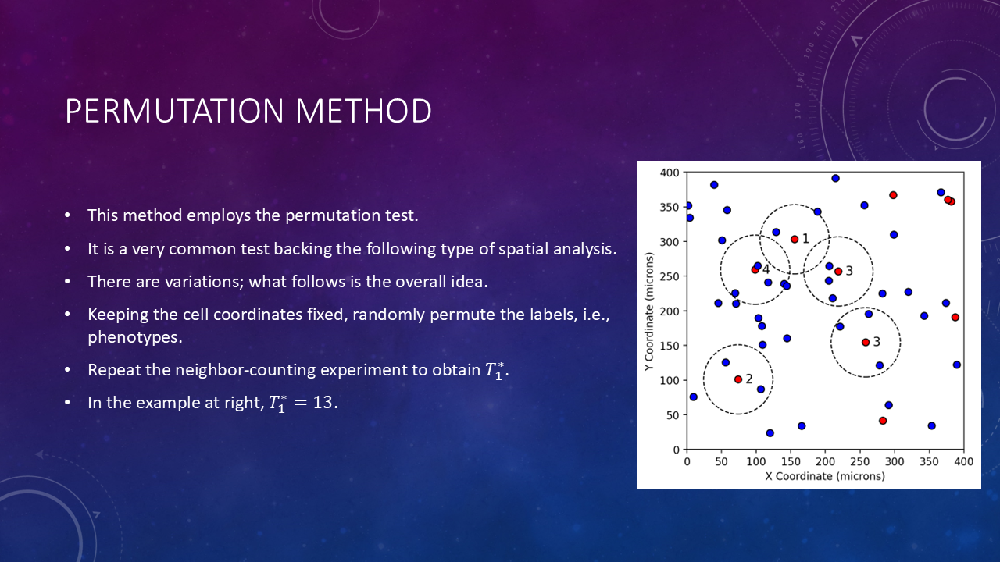

# Spatial Omics Data Analysis with MAWA

## Session 3: Pairwise spatial analysis using hypothesis testing

- [Spatial Omics Data Analysis with MAWA](#spatial-omics-data-analysis-with-mawa)
  - [Session 3: Pairwise spatial analysis using hypothesis testing](#session-3-pairwise-spatial-analysis-using-hypothesis-testing)
  - [TODO](#todo)
  - [Session information](#session-information)
  - [Concepts](#concepts)
  - [MAWA demo](#mawa-demo)

## TODO

- [ ] Make session script
- [ ] Make video
- [ ] Update links in PPT
- [ ] Update links XXXX in Session information section below

## Session information

- **Date**: Tue 10/29/24, 1-2 PM
- **Speaker**: Andrew Weisman, Ph.D.
- **[Session information](https://bioinformatics.ccr.cancer.gov/btep/classes/spatial-omics-data-analysis-pairwise-spatial-analysis-using-hypothesis-testing-with-mawa)**
- **[Main training page](https://github.com/ncats/mawa-training-materials/tree/develop)**
- **[Video of session material](XXXX)**
- **[Session slides](XXXX)**
- **[Recording of session](https://cbiit.webex.com/cbiit/ldr.php?RCID=12b75c9528dfc122df185d93b9281af5)**
- All data generously provided by the David Wink lab

## Concepts

We will demonstrate how to use hypothesis testing in MAWA to learn about the spatial distributions of two species of cells on a slide to get insight into how the cells interact.

Note that the coordinates of the cells are the same as in the previous image, but the colors are randomly permuted.

So, for the 5 permutations, we have T* = [13, 15, 14, 9, 12].

Now we will review the usual method for calculating P values relative to a known null distribution of a statistic T such as the one above.

## MAWA demo

bleh
