# Spatial Omics Data Analysis with MAWA

## Session 4: Neighborhood Analysis using Spatial UMAP

- [Spatial Omics Data Analysis with MAWA](#spatial-omics-data-analysis-with-mawa)
  - [Session 4: Neighborhood Analysis using Spatial UMAP](#session-4-neighborhood-analysis-using-spatial-umap)
  - [Session information](#session-information)
  - [Concepts](#concepts)
    - [Review Data Ingestion/Unification](#review-data-ingestionunification)
    - [Introduction to Neighborhood Profiles](#introduction-to-neighborhood-profiles)
    - [MAWA Demo of Neighborhood Profiles](#mawa-demo-of-neighborhood-profiles)

## Session information

- **Date**: Wed 11/06/24, 11 AM - 12 PM
- **Speaker**: Dante J Smith, Ph.D.
- **[Session information](https://bioinformatics.ccr.cancer.gov/btep/classes/spatial-omics-data-analysis-neighborhood-analysis-using-spatial-umap-mawa-4)**
- **[Main training page](https://github.com/ncats/mawa-training-materials/tree/develop)**
- **[Session slides](../session_4/Spatial%20Omics%20Data%20Analysis%20with%20MAWA%204.pdf)**
- **[Recording of session](https://cbiit.webex.com/cbiit/ldr.php?RCID=12b75c9528dfc122df185d93b9281af5)**
- All data generously provided by the David Wink lab

## Concepts

### Review Data Ingestion/Unification

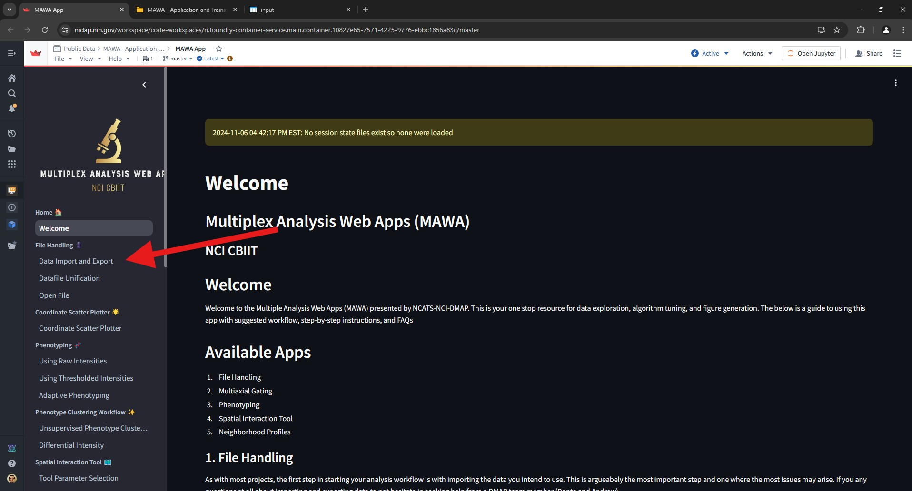

When you first open MAWA, you are going to see a Welcome Screen that looks like this. To start your data ingestion journey, you will click on the button labeled *Data Import and Export*

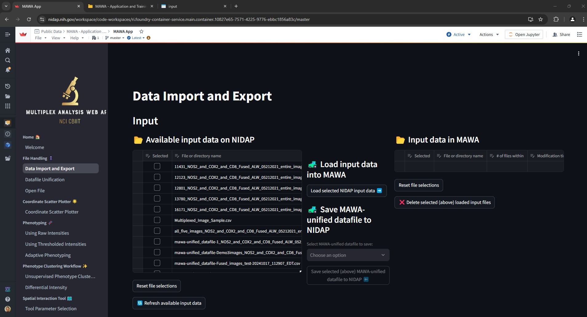

At the top of the page, you will see two tables, one labeled as Available Input on NIDAP, and another labeled as Input Data in MAWA. There will be two buttons positioned between these tables. The table on the left displays all data available on NIDAP that could be imported in MAWA. Verify that you can find all your necessary files in this left-hand table. Recall that this table is displaying the csv files listed in this the input folder in the top-level folder on NIDAP.

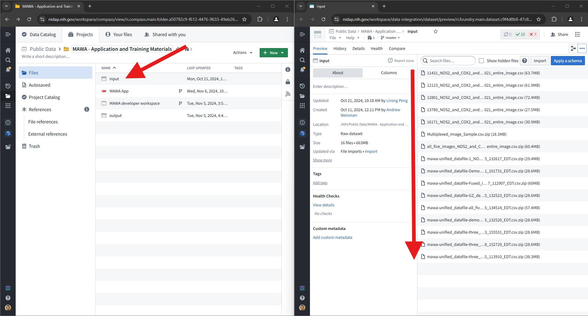

This is what that folder looks like. You can see the app itself (red crown), the developer environment (white card), and then two data folders-the input folder and the output folder. If we look at the inside of the input folder, we can see several different files that have already been uploaded. Any time you want to add new data to this folder, you will do so in the input folder. You can drag and drop new files here. Once you do, you should be able to see them displayed in this left-hand table in the input MAWA page.

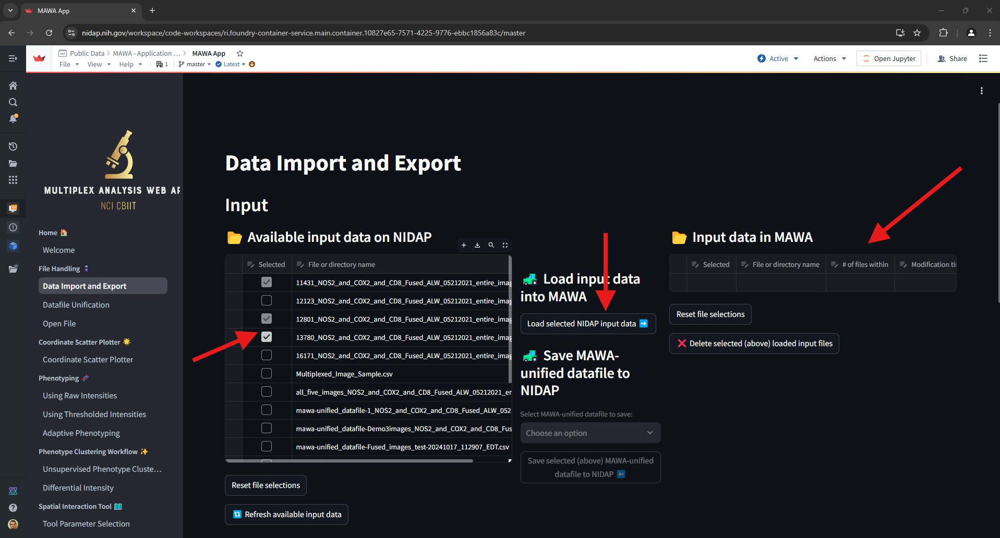

Once all your data files are accounted for, select the files you want to import into MAWA. Click the button that says Load selected NIDAP input data, which is the upper of the two middle buttons. You will know what the data is being loaded, because the widgets will grey out slightly and there is text in the top right corner that says running with a running figure. This goes for any action in MAWA. You know there are underlying processes being performed when you see this icon in the top right. Once the load step has been completed, verify that all your expected files appear in the right-hand table. With this step done, we can unify and preprocess our files.

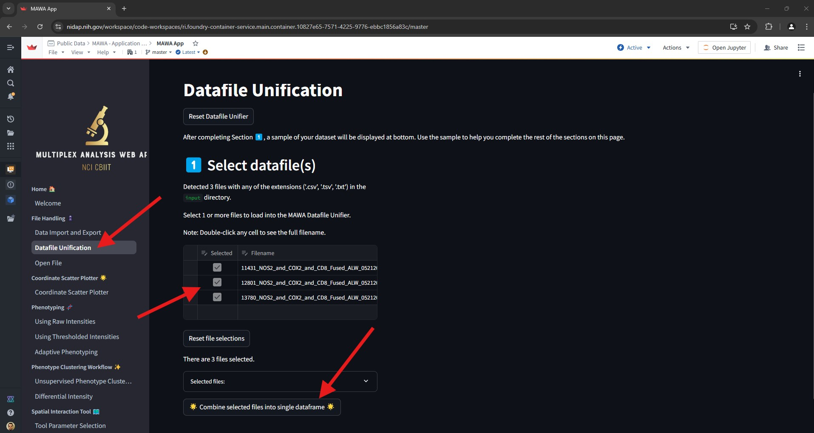

Select the page in the menu on the left titled *Datafile Unification*. You will see a table on the left with the files you want to use in your analysis. Select all or some of those files and click the button ‘Combine selected files into single dataframe’ to combine them.

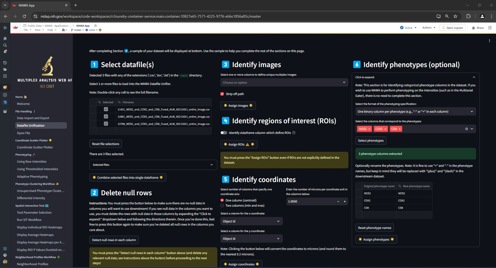

Follow the rest of the instructions on this page to fully clean and process your dataset. This includes:

- Step 2: Identifying rows with NA entries and removing them
- Step 3: Identifying a column that can be used to label the images in your dataset
- Step 4: Identifying a column which labels ROIs (if any)
- Step 5: Identifying the columns which describe the Cell coordinates
- Step 6: Identifying the column or columns which describe any pre-assigned phenotypes (if any)
- Step 7: Save a copy of the mawa_unified_datafile which is being created throughout this process. If you ever pause your analysis activities for the day and want to return to working on the same dataset, this unified_datafile will retain all the changes you made in this unification step. Make sure to upload back to NIDAP in the Data Import and Export Step

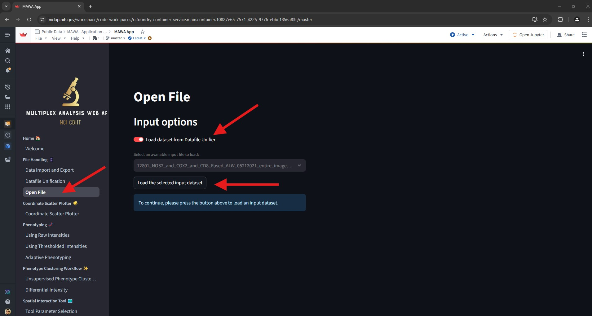

Once the unification step is done, and any unified files are done being saved, move to the next page from the menu on the left titled *Open File*. If you have just finished the datafile unification step, make sure the toggle is on to load the data that is still loaded on that page. If you are returning to analysis and are loading a unified_datafile, make sure the toggle is off and select your unified_datafile from the drop-down menu. In either case, click the load button to load your data into memory, and review your data in the preview at the bottom of the screen.

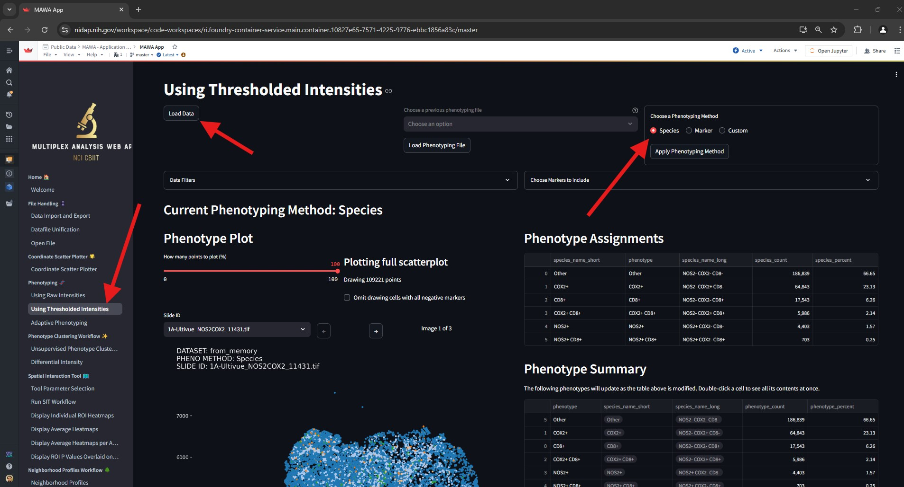

The final important step to perform before considering Neighborhood Profiles is the phenotyping step. MAWA offers a variety of different ways to apply phenotypes to the cells in your dataset. Because the dataset we are using already has Thresholded intensities, we can use the phenotyping method called Thresholded Intensities. In the left-hand menu, in the category called Phenotyping, select the page titled Using Thresholded Intensities. At the start, nothing should be loaded in the widgets and windows in the lower part of the page. Click the button in the top left titled Load Data. This will load the unified_dataset into this phenotyping page. You should see the tables and figures in the lower part of the page populate. There is a scatterplot on the left of one of your images. There is also a table on the right which describes the different species of cell that are present in this dataset. In the top right corner is a set of radio buttons to assign different types of phenotypes. For simplicity, I will not go into much detail about each, but for demo purposes, I will select the Species option. The species option will simply assign a phenotype name that is identical to the species of the cell. When this option is selected and applied, the tables and figure will be updated with the phenotype names. At this stage, we are ready to consider Neighborhood Profiles

### Introduction to Neighborhood Profiles

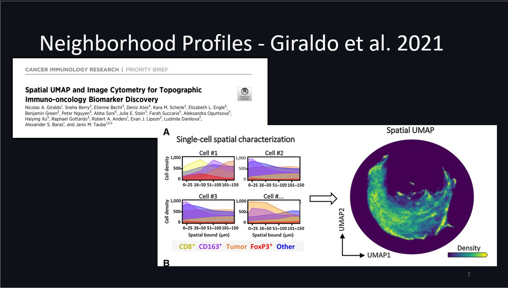

When we were in the early stage of developing MAWA, we worked with Will Heinz of the OMAL group about how we might implement methods from a recent publication. The paper in question was Giraldo et al. 2021, titled Spatial UMAP and Image Cytometry for Topography Immuno-oncology Biomarker Discovery, from the Taube lab at Johns Hopkins. They were determined to identify if certain cell phenotype groupings were more or less prevalent in a cohort of cancer patients that survived or didn’t survive after a period of 5 years.

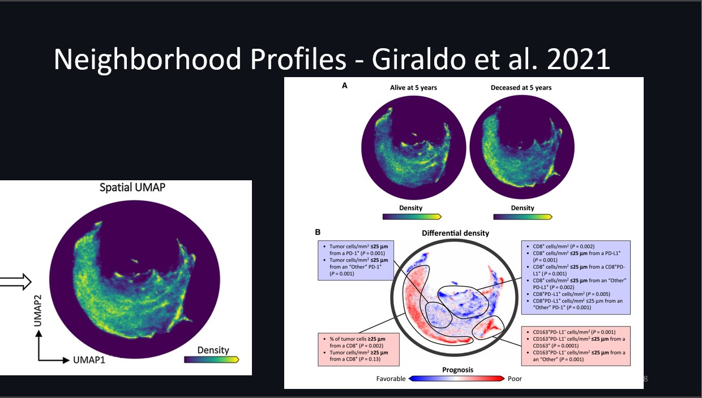

Indeed, in their results, by using a UMAP, which is this 2D histogram we see here, they were able to find samples of cells that had diverging phenotype neighborhood characteristics between surviving and not surviving groups.

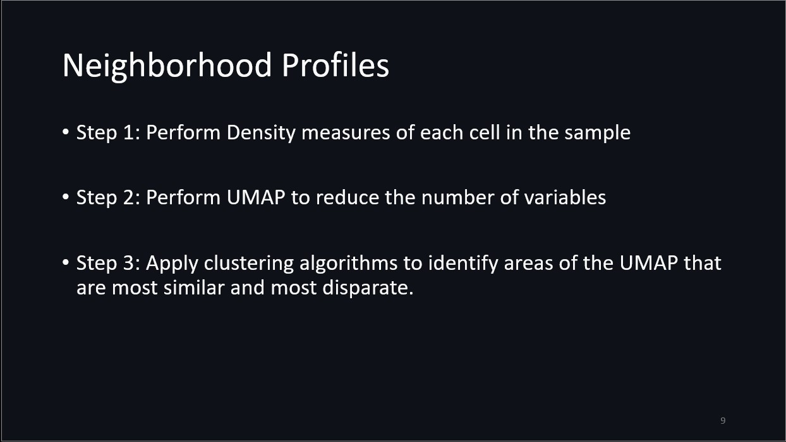

So what are the steps I am going to take to perform Neighborhood Profiles?

- Step 1 will be to perform a density measure of the phenotyped cells in the sample
- Step 2 will perform UMAP to reduce the number of variables in our sample
- Step 3 will be to apply a clustering algorithm to the UMAP to identify areas that are the most similar or the most disperate.

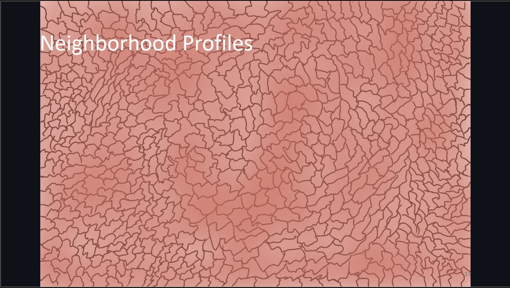

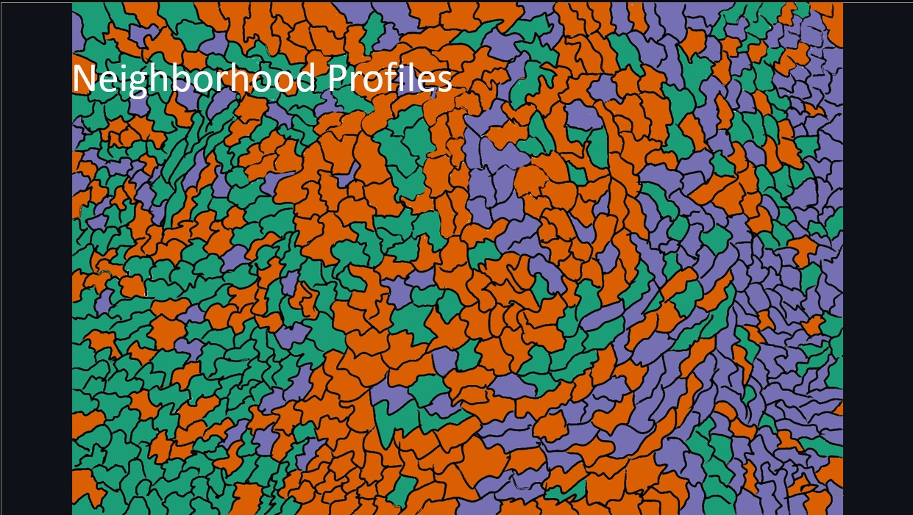

Let’s say you have a dataset of 100k cells. They could come from multiple tissue samples, from multiple patients. Each of these cells has the x/y coordinates of their centroid on the tissue recorded, as well as the phenotype(s) that the cell expresses. It also helpful to have a handful of other useful outcomes or features for later comparison, like Dead/Alive, Cell Area, patient sex, treatment type, cancerous/noncancerous.

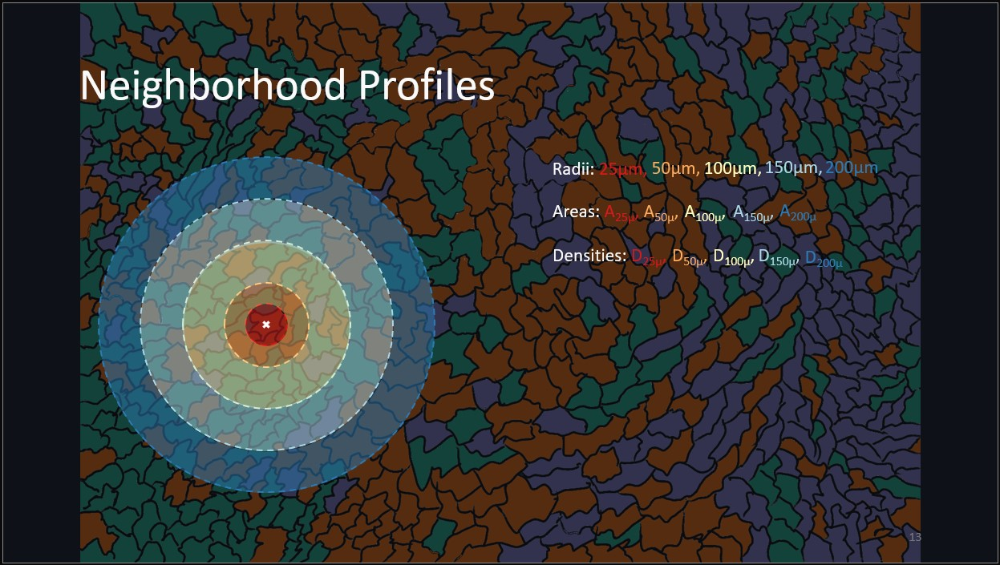

For each cell in the sample, we identify the other cells in direct proximity to that cell. To make it easier to track, we also identify different distances from our target cell to better define proximity. These distances are 25, 50, 100, 150, and 200 microns. Since the counts of these cells might be influenced by how much area they can occupy, it makes sense to measure the number of cells as a density within the area of an annulus surrounding the cell. For ease, let’s refer to those areas as A25m, A50m, A100m, A150m, and A200m. Therefore, the density measures could be described as D25m, D50m, D100m, D150m, and D200m. So, when we measure how the density of cells surrounding our target cell changes, we can begin to understand its unique neighborhood. We can draw a line plot of the overall density change for this particular cell over distance. This line plot consists of 5 measurements. But of course, the change in density of all cell types is less interesting than the change in cell density separated by phenotype. Now things start to get interesting, because we can see how phenotype can play a role in which cell types are included or not included in these predetermined distances.

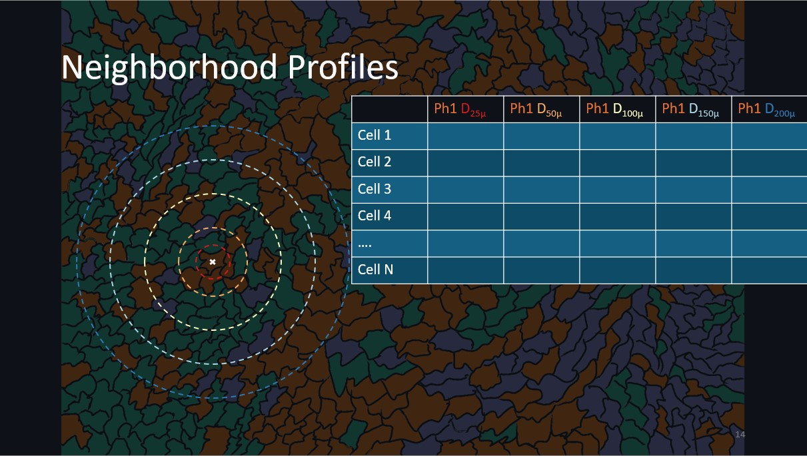

If we have 3 phenotypes, well now we have 15 different measurements per cell that we are tracking. If we wanted to try to aggregate these findings, or perform statistical analysis on this dataset, we would have 15 different features (dimensions) to consider. When we have datasets with a high number of dimensions, like this one, it makes sense to try to perform decomposition on the feature set.

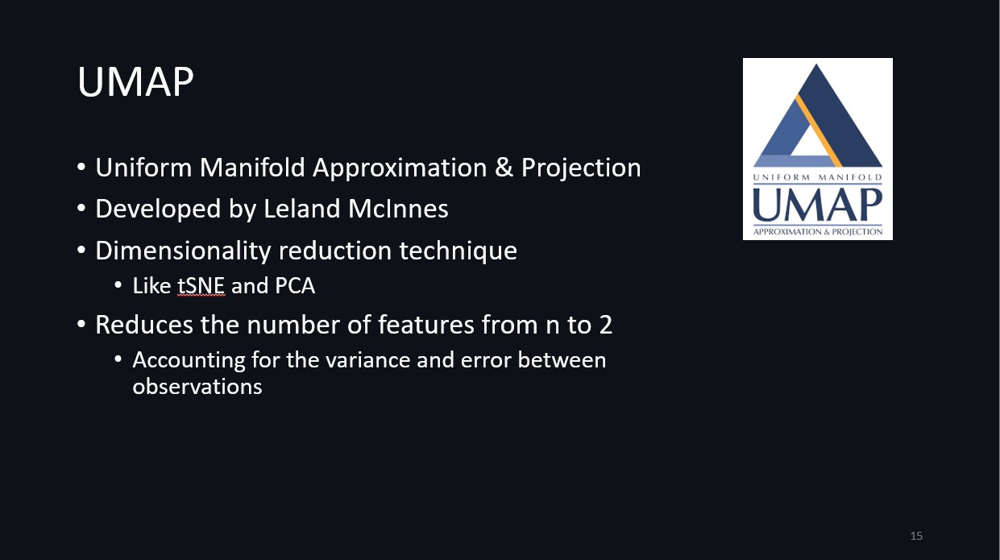

There are a myriad of different feature decomposition methods out there, but the one used in the Giraldo et al. 2021 paper was UMAP, which stands for Uniform Manifold Approximation and Projection. It is a fast, easily understandable method that is an alternative over other methods like t-SNE or PCA. In essence, these 15 features reduce down to 2, which make it very easy to perform clustering on.

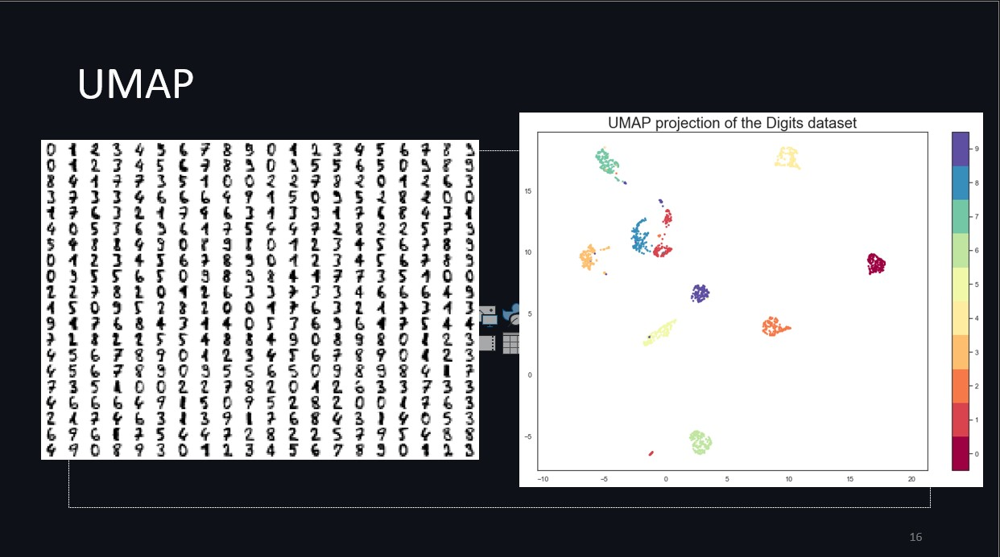

To help drive this point home, let's take a look at another non-cytology dataset. On the left are examples of hand drawn numerals. If you are looking to characterize and distinguish different features you might notice that a 1 has a stroke at the very top of the image, the 3 has two loops on the right side of the image, and a 4 has a horizontal line in the middle. We could analyze these numerals from almost an infinite set of features to descripe and classify them individually. But in order to make sense of this large dataset of features we need to find a way to reduce the dimensions that we are studying. UMAP is perfect for this in fact, this example is used on UMAP's documentation page. When this dataset is passed through the UMAP, you get a figure that looks like the one on the right. They are clusters of written numerals that are distinct from each other. UMAP was able to take all the myriad features that distinguish the numerals from one another, and distill them down to two variables, and still retained all the variance between the features. Now, in this example, all the datapoints are pre-labeled as belonging to the numbers 0-9. If we didn't have those labels, we might be able to make some assumptions about where one set of numerals ends, and another begins. The 0s are predistinct in their cluster in the far right. So is the cluster for numeral 6. If these clusters were not pre-labeled, it might be hard to tell if the clusters for numerals 3 and 8 should be two distinct colors; spatially they are very close together. Indeed a 3 has many of the same features of an 8. So our neighborhood profiles process will add a third step, which is applying a clustering algorithm to the produced UMAP.

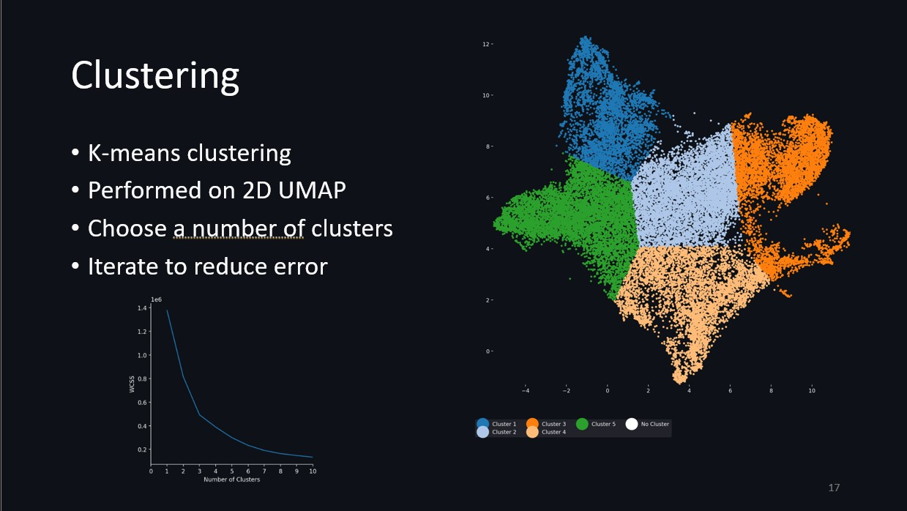

The clustering algorithm we have chosen to implement is k-means. It is an algorithm that is applied to the 2D UMAP data produced in the previous step. One of the interesting aspects of this sort of clustering, is the user can choose any number of clusters they want to use for the algorithm. There is clearly a possibility of having too few clusters, and if you choose maybe one or two clusters, the center of the chosen cluster might be too far from the average center of the clustered points. This error can be measured and tracked. In fact, as the number of clusters increases, the amount of error decreases. This decrease however has diminishing returns, and there is a limit to how much you can reduce the error with increasing clusters. Tracking this error vs cluster relationship is done with a within-cluster sum of squares (WCSS) figure as seen in this slide. Sometimes called an elbow plot, its generally accepted that the point at the elbow in the plot (in this case 3) is the most effecient number of clusters to choose for your data.

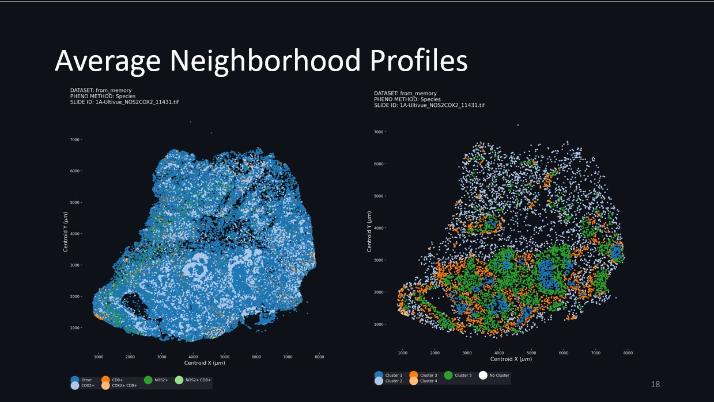

So now that we have identified our clusters. We can take a look at where those neighborhoods lie in our spatial coordinates tissue sample. As a reminder, the image on the left is one of our tissue images with the cells colored by phenotype. There are a bunch of different phenotypes throughout this image, but its really hard to discern any sort of pattern or combination of cells that determine a unique neighborhood. However if we were to color the cells by the cluster they belong to, we can see continuous areas that seem to follow a pattern. From the density measurements taken in Step 1, we can now feel confident we can measure a general Neighborhood Profile from all the cells that are assigned to a given cluster.

### MAWA Demo of Neighborhood Profiles

So, everything I recapped in the beginning are necessary steps to start using Neighborhood Profiles. You need to have your data loaded into NIDAP, preprocessed using the Data Unifier, and phenotyped using at one of the many methods that MAWA has to offer. It is especially important that we are using spatial data (they x and y centroid locations), and a phenotype assigned to each cell.

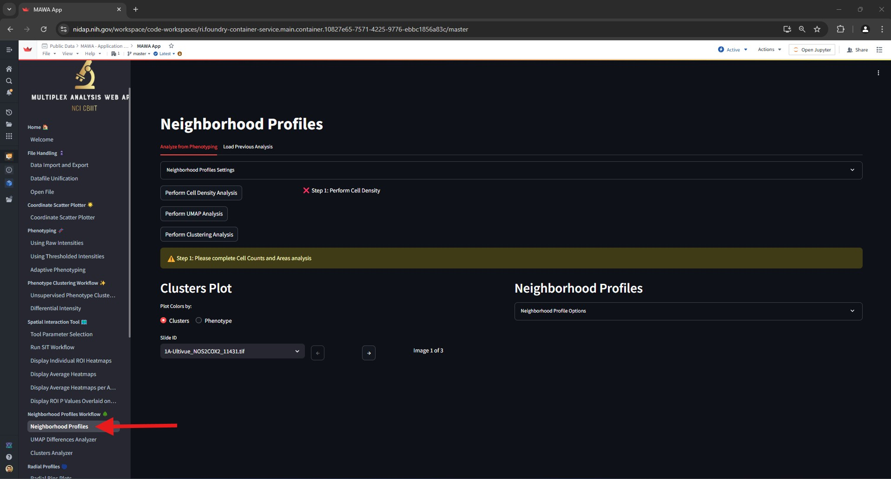

Once all that is completed, you will click on the tab on the left-hand side labeled as Neighborhood Profiles, under Neighborhood Profiles Workflow. From here, you will see a page that three buttons on the left hand side of the screen, and a message saying Step 1 please Perform Cell Density Analysis. If instead you see a message that says Step 0 please complete phenotyping, it might mean your dataset is not properly setup to perform Neighborhood Profiles. Above the message is a collapsable widget which holds settings for performing the Neighborhood Profiles. I am going to use the default values for now, but if anyone has questions about how these affect the analysis, and when they should be changed, we can talk about it after the talk.

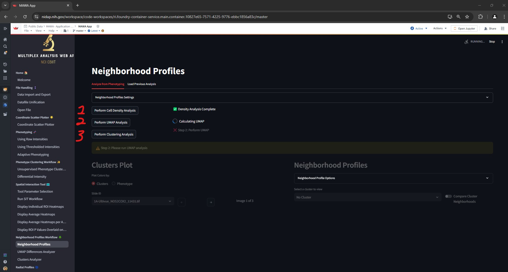

We are going to start by hitting button #1 which is running the Cell Density Analysis. Once clicked, you will see a spinning wheel to indicate that this process is happening. For this demo dataset today, this should be completed in under 30s. The amount of time this takes will vary depending on the number of cells you have, the number of images in your sample, and the number of phenotypes selected on the previous step. When the cell density measure is complete, we will see a new message pop up telling us to complete Step 2, Complete UMAP analysis. All you need to do is click the button that says Perform UMAP analysis. Again, we are going to maintain the default values for this demo. This should take about 30-40s to complete. Again this amount of time will depend on the number of cells in your sample, the number of images, and the number of phenotypes.

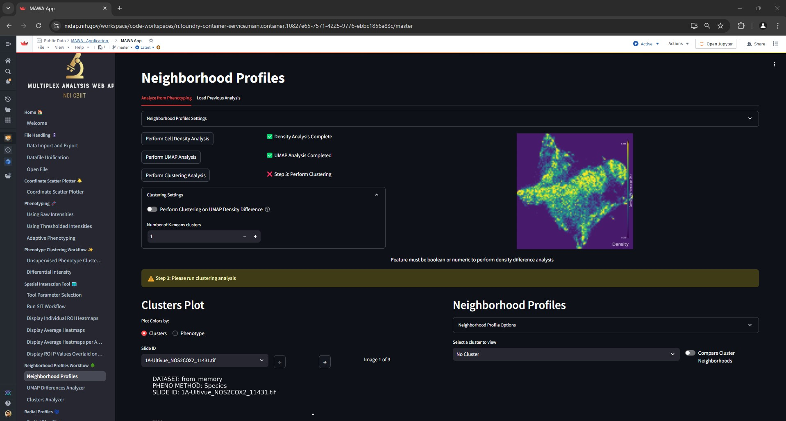

When the UMAP is done, you will see a new message appear, and a new set of widgets and figures. The figure is a scatterplot of the 2D UMAP that has been created as a result of step 2. In reality its actually closer to a 2D histogram in which cells are placed into bins for common x and y values assigned during the spatial UMAP step. The intensity of the colors shows more cells aassigned to that bin. A settings window now appears on the left along with a message that says Step 3: Perform Clustering Analysis. Additionally, you will see a scatterplot of one of your images that is colored white for a No Cluster condition.

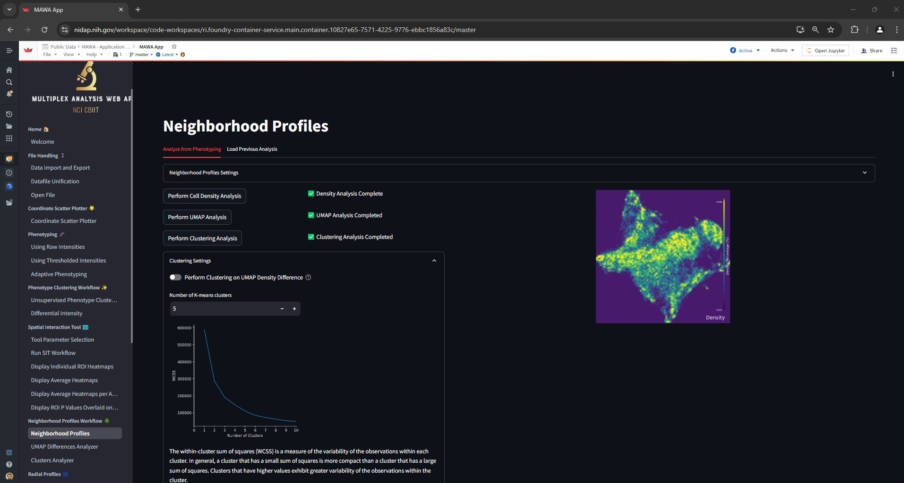

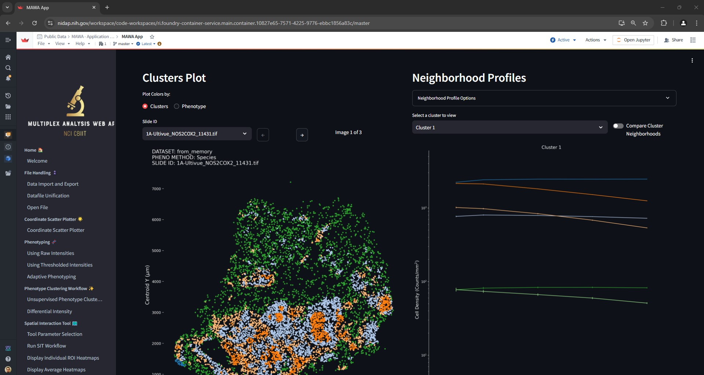

There are two ways to perform the clustering. The first one is very straight forward. Based on the UMAP figure you see on this page; it will perform k-means clustering on the non-empty bins for a given k that you set in the settings box below. This clustering step should take roughly 1min to complete. When it is done, you will see your scatterplot figure at the bottom of the screen colored by the clusters that were created by kNN. To the right you will also see the actual Neighborhood Profiles line plot. Here you can further investigate the make of your individual clusters, or even compare clusters. 

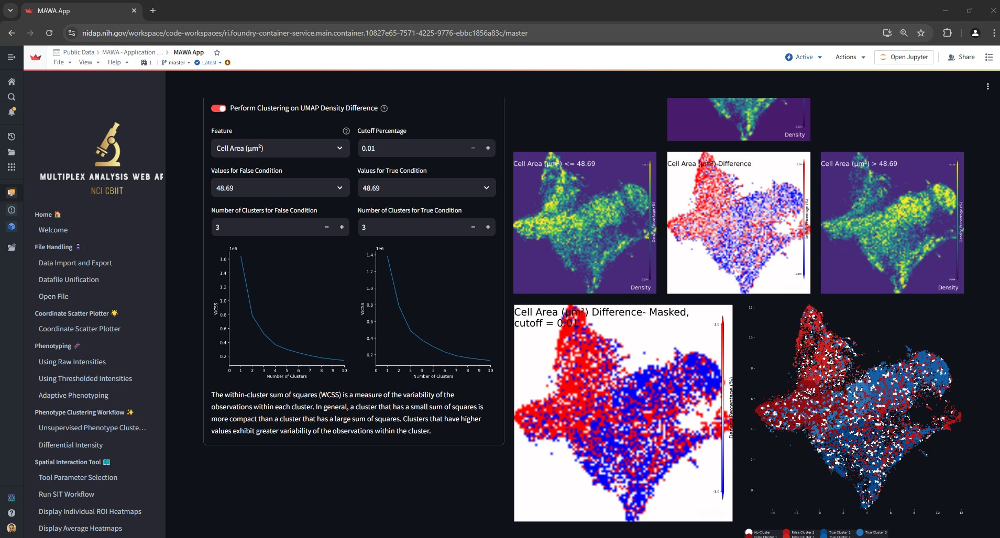
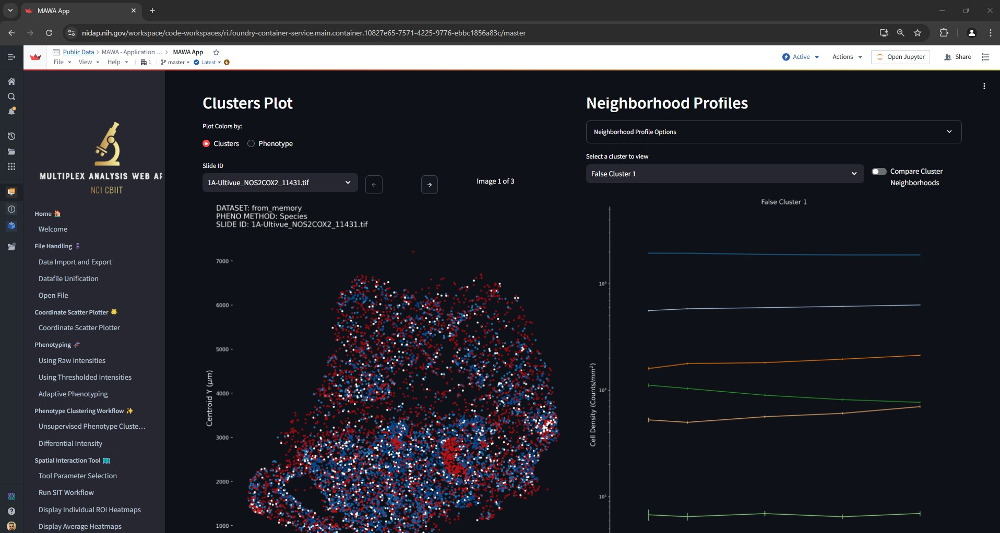
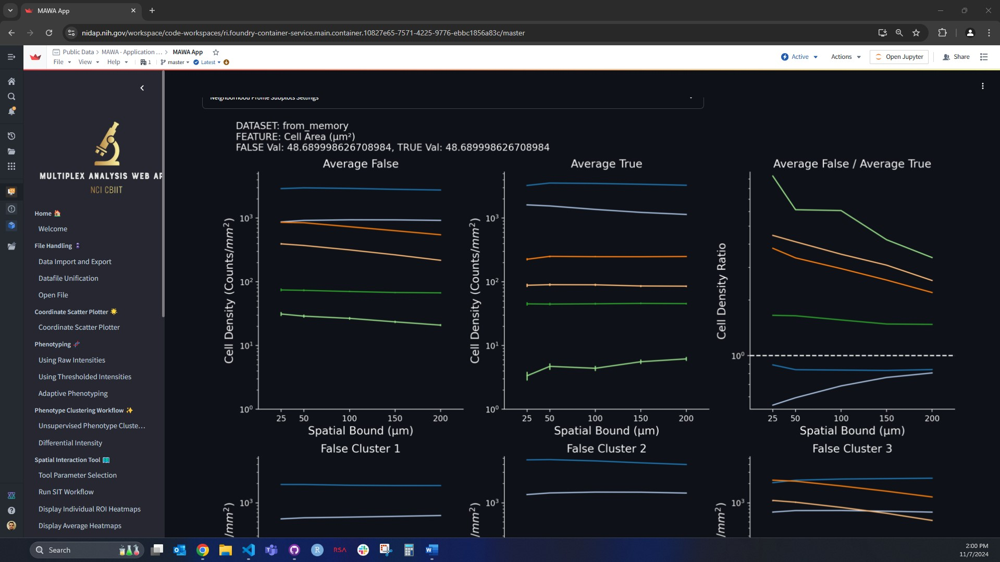

The second method is a bit nuanced, but it can lead to some interesting scientific discourse. If instead of performing K-mean clustering on the UMAP, instead, you can first split the UMAP figure, and its data, into two parts. By flipping the toggle here, you can select a feature by which to split the UMAP. The feature comes from your dataset and can be anything from survival after 5 years, to Cell area, to patient zip code. In the case of a binary feature like survival, you will see the values box default to 0 and 1. In the case of a numerical feature like Cell area, you will see the values split at the median by default. And for non-continuous numerical or string values, you are able to choose any two values to compare. This clustering method does not work if you have one or few unique values in the chosen feature. When this clustering step is selected, the following analyses are performed:

- The Full UMAP dataset is filtered by the feature at each of the two selected values. This creates a UMAP for a value 1 (False) and a UMAP for a value 2 (True).
- Next a difference is taken between the UMAP of value 2 subtracted from the UMAP of value 1. This creates a new 2D histogram as seen in the middle here where dark regions of red represent high cell counts of value 1, and dark regions of blue represent high cell counts of value 2. Lighter and white colors represent parts of the UMAP where there is not a strong preference towards value1 or value 2, and it’s more of a mix of the two values. This is called the Difference UMAP
- A mask is created of the Difference UMAP and only the most strong (dark) blue regions and the most strong (dark) red regions are selected out of the mask. Any lighter blue/red or white regions are masked out.
- From this mask, two separate kNN clustering analyses are performed; one on the red region (Left hand False condition), and on the blue region (Right hand True condition) of the masked difference UMAP. From each of these clustering steps, the algorithm returns separate clusters (False clusters & True clusters). You can tune the number of clusters produced for each set of False/True clusters.

Again, like the previous clustering method, the scatterplot of the spatial coordinates tissue sample have been updated to reflect the clusters that applied, and this time, there is an extra category of any cells that were not clustered for being overly contributing to either of the two test conditions. Additionally, the neighborhood profiles figure will have more clusters to display and compare against. In fact, in this method, there are so many different way to compare the Neighborhood Profiles, MAWA has pregenerated a great majority of them as a subplot at the bottom of the page.

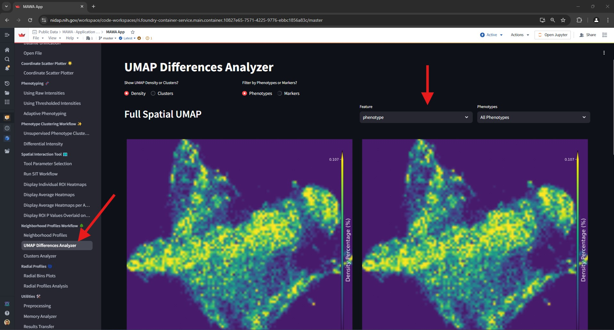

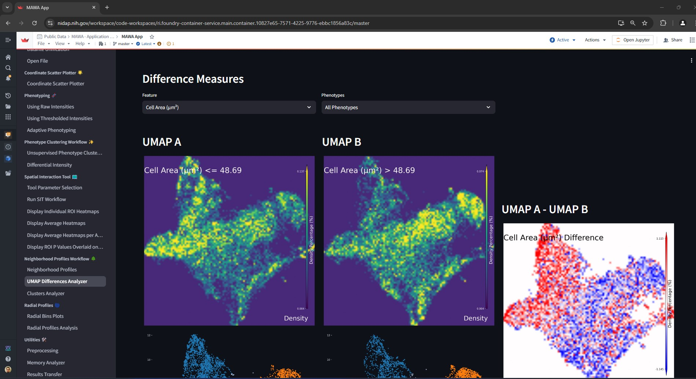

After completing all the necessary Neighborhood Profiles steps, including choosing one of the two clustering methods, we can further explore our data using the next two pages in this Neighborhood Profiles section on MAWA. The first page is titled UMAP Differences Analyzer. This page allows you to investigate how different features of your dataset, or different phenotypes, change the shape of your UMAP. For example in our demo dataset, you can select a feature in the feature drop down such as Cell Area. This will first split the dataset into two halves, similar to the second clustering method on the previous page. Then it will filter the UMAP by one of those data sets (usually the True or greater than halves). This is a fast way to prototype which parts of the UMAP contribute to features in the dataset, if any. On the lower half of the page is another way to view this filtering method, but it shows both halves of the UMAP split, it shows the difference between them, and it shows how the clusters are arranged on the UMAP. Again this meant to offer an exploratory analysis of your data, and offer a way to ask new questions of your data.

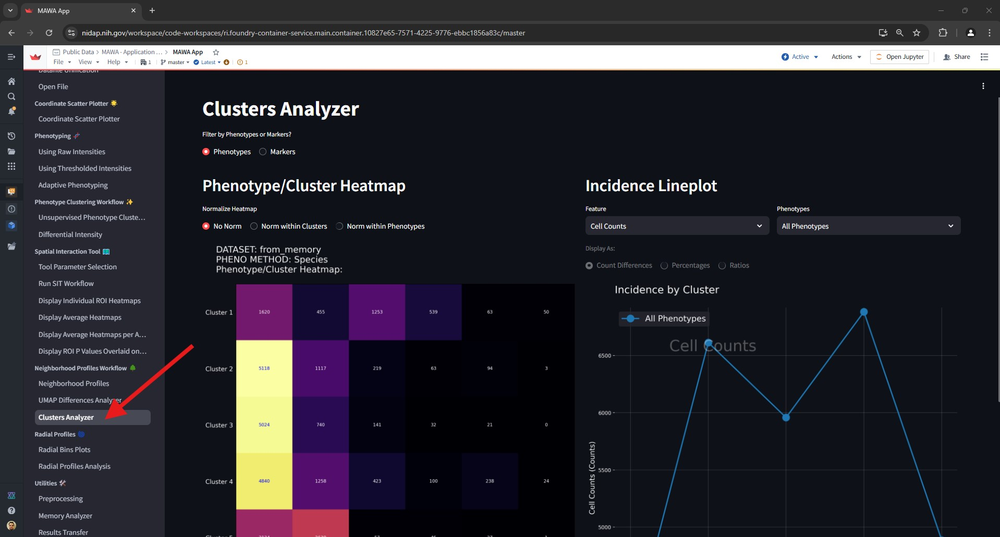

Finally, let's take a look at the last page in the Neighborhood Profiles section, the Clusters Analyzers page. This page has been created to investigate the composition of cell phenotypes in assigned clusters and the incidence of different dataset features appearing in specific cluster types. The Cluster Analyzer page contains two figures generated from the upstream data analysis:

- Phenotype/Cluster Heatmap
- Incidence Lineplot

The heatmap offers a view of the number of each phenotyped cell located within each cluster. It offers three normalization options for viewing the heatmap:

- No Norm: No normalization is applied to the heatmap. The relative colors for each cell is scaled for all cells in all phenotypes in all clusters. If you were to sum the numbers shown in the grid, they would sum to the total number of cells fit to the spatial-umap model.
- Norm within Clusters: The grid values are decimal values of the number of cells within a cluster assigned to a given phenotype. In this schema, the relative color of the grid is based on the within-row values. If you were to sum the values of each row, they would sum to 1
- Norm within Phenotypes: The grid values are decimal values of the number of cells assigned to a specific phenotype within each clister. In this schema, the relative color of the grid is based on the within-column values. If you were to sum the values of each column, they would sum to 1.

The Incidence Lineplot details how the cells within each cluster differ in their expression of the data features recorded alongside the cell positions and phenotype values. These features range from boolean values (True/False), continuous values (-1, 0, 1), and string values('time0'). There are two selection boxes to augment the incidence line plot, and a radio button to select the type of comparison to perform. They are the following:

Feature Select box: Features that can be considered for the Incidence lineplot.

- Cell Counts: The number of cells assigned to a given cluster
- All other columns in your dataset: Cell Area, Survival, Gender, NORMOXIC, etc

Phenotype Selection box: The phenotype the cells being plotted. The options shown are:

- All Phenotypes: Shows all cells irrespective of phenotype
- The other phenotypes that have been selected in the Phenotyping stage of the workflow.

DisplayAs Radio Button: How the values of the Feature selectbox should be displayed. This radio button is disabled for the Cell Counts condition, but is enabled for any other Feature selection. The options to be displayed are:

- Count Differences: The value shown on the y-axis is the difference between the number of cells in a cluster in the Y>0 condition - subtracted from the number of cells in that cluster in the Y<0 condition.
- Percentages: The value shown on the y-axis is the percentage of cells that match a feature condition in that given cluster. If you were to sum all the values across the clusters, they would sum to 100%.
- Ratios: The value shown on the y-axis is the ratio of r1/r0 where r1 is the precentage of cells that match the feature of condition shown on y>0 in that cluster, and r0 is the percentage of cells that match the feature of the condition show on y<0 in that cluster.
